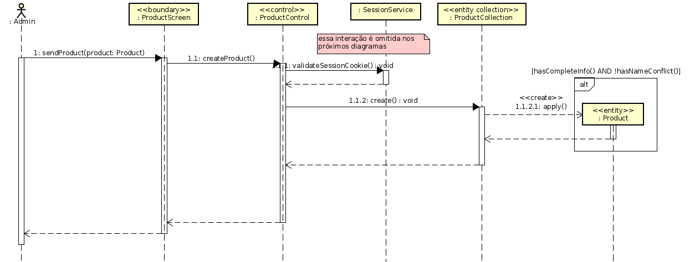

---

marp: true
author: vitor maia
theme: uncover
paginate: true

---

# Stock Management System

No contexto de uma loja genérica, queremos criar uma aplicação que permita.
- Gerenciar produtos que são vendidos
- Gerenciar matéria prima que é comprada
- Visualizar o fluxo de caixa do negócio

---
# Diagramas de casos de uso

---

# Criação de Conta
- Atores: Usuário
- Pré-condição: Nenhuma
- Pós-condição: Uma conta é registrada
- Fluxo de eventos principal:
  1. O usuário vai para tela de criação de conta
  2. O usuário informa seu nome, email, nome de loja e senha.
---
  3. O usuário confirma sua senha.
  4. O sistema valida as informações passadas, não permitindo 2 usuários com
  os mesmo email, ou senhas fracas.
  5. Caso sejam informações válidas, o sistema cria uma conta para o usuário
  6. O usuário é redirecionado para tela de login.

- Fluxo de eventos secundário:
  1. No passo 4, caso a requisição seja inválida, o usuário recebe um
  feedback informativo.

---

# Diagrama de Sequência:

---

### Realizar Login
- Atores: Usuário
- Pré-condição: O usuário ainda não estar logado
- Pós-condição: É criada uma sessão para o usuário
- Fluxo de eventos principal:
  1. O usuário vai para tela de login e preenche seu email e senha
  2. O sistema valida as informações, verificando a existência do
  usuário e o autenticando contra sua senha
---
  3. Caso as informações sejam válidas, o usuário é redirecionado
  para o dashboard
- Fluxo de eventos secundário:
  1. No passo 2, caso as informações não sejam válidas, o usuário
  recebe um feedback "Email ou senha inválidos"

---

# Diagrama de sequência

---

# Visão geral das classes

---

### Registrar Matéria Prima
- Atores: Administrador
- Pré-condição: O usuário está logado
- Pós-condição: A matéria prima é registrada.
- Fluxo de eventos principal:
  1. O usuário seleciona "Matérias primas"
  2. O usuário seleciona "Adicionar Matéria Prima"
  3. O usuário preenche as informações da matéria prima: nome, quantidade inicial em estoque.
---
  4. O sistema valida as informações, impedindo o cadastro de matérias
  primas com mesmo nome.
  5. Caso seja uma matéria prima válida, ela é persistida
  6. O usuário recebe um feedback afirmando que a matéria prima foi salva.
- Fluxo de eventos secundário:
  1. No passo 4, caso a requisição seja inválida, o usuário recebe um feedback informativo
---

### Registrar produto
- Atores: Administrador
- Pré-condição: O usuário está logado
- Pós-condição: O produto é registrado
- Fluxo de eventos principal:
  1. O usuário seleciona "Produtos"
  2. O usuário seleciona "Adicionar produto"
  3. O usuário preenche as informações do produto: nome,
  preço, quantidade inicial, matérias primas usadas e respectivas quantidades.
---
  4. O sistema valida as informações, impedindo cadastro de produtos
  com nome repetido, ou informações incompletas (sem nome, preço ou qtd inicial)
  5. Caso seja um produto válido, o sistema persiste o produto
  6. O usuário recebe um feedback afirmando que o produto foi salvo.
- Fluxo de eventos secundário:
  1. No passo 4, caso a requisição seja inválida, o usuário recebe um
  feedback informativo
---

# Diagrama de sequência

---

# Visão geral das classes

---

### Registrar fornecedor de matéria prima / produto
- Atores: Administrador
- Pré-condição: O usuário está logado.
- Pós-condição: O fornecedor é registrado
- Fluxo de eventos principal:
  1. O usuário seleciona "Fornecedores"
  2. O usuário seleciona "Adicionar Fornecedor"
  3. O usuário preenche as informações do fornecedor: nome, cnpj

---
  4. O usuário define que produtos e matérias primas serão fornecidas por ele, e o preço padrão.
  5. O sistema valida as informações, não permitindo mais de um
  fornecedor com o msm cnpj
  6. Caso as informações sejam válidas, o sistema guarda o fornecedor
  7. O usuário recebe um feedback afirmando que o produtor foi salvo.
---
- Fluxo de eventos secundário:
  1. No passo 5, caso as informações sejam inválidas, o usuário recebe um 
  feedback informativo
---

### Atualizar estoque de matéria-prima/produto
- Atores: Administrador
- Pré-condição: O usuário está logado
- Pós-condição: O estoque é atualizado
- Fluxo de eventos principal:
  1. O usuário seleciona "Estoque"
  2. O usuário seleciona "Atualizar"
  3. Opcionalmente, o usuário informa o motivo da atualização
---
  4. O usuário seleciona os items (produtos ou matérias primas) que deseja
  atualizar o estoque, e as quantidades que deseja adicionar ou subtrair.
  5. Para cada produto adicionado, o usuário tem a opção de usar a matéria prima
  em estoque ou não
  6. O sistema valida as informações, verificando se há matéria prima 
  para os produtos que foram adicionados
---
  7. O sistema atualiza o estoque de produtos/matérias primas.
  8. O usuário recebe um feedback informando que a atualização foi bem sucedida.

- Fluxo de eventos secundário:
  1. No passo 6, caso seja uma atualização inválida, o usuário recebe um feedback
  informativo.
---

### Registrar vendas
- Atores: Administrador e Serviço de Transporte (Ator externo)
- Pré-condição: Estar logado no sistema
- Pós-condição: A venda é registrada
- Fluxo de eventos principal:
  1. O usuário seleciona "Vendas"
  2. O usuário seleciona "Registrar venda"
---
  3. O usuário preenche as informações da venda: endereço, método de entrega, 
  produtos e quantidades
  4. O sistema valida as informações, impedindo que a venda supere o estoque.
  5. O sistema se comunica com o serviço de transporta para calcular o frete da
  venda, anexando-o à venda.
  6. O sistema salva a venda e retira os produtos vendidos do estoque.
---
- Fluxo de eventos secundário:
  1. No passo 4, caso as informações não sejam válidas, o usuário recebe um
  feedback informativo.
---

# Diagrama de sequência

---

### Registrar compra matérias primas/produtos
- Atores: Administrador
- Pré-condição: Estar logado no sistema
- Pós-condição: A compra é registrada
- Fluxo de eventos principal:
  1. O usuário seleciona "Estoque"
  2. O usuário seleciona "Registrar compra de Matéria Prima ou Produto"
---
  3. O usuário informa quais matérias primas e produtos foram compradas, especificando
  o fornecedor, a quantidade e o preço por unidade.

  4. O sistema valida as informações.
  6. Caso sejam informações válidas, o sistema registra a compra da matéria prima
  7. O usuário recebe um feedback informando-o que a compra foi registrada
- Fluxo de eventos secundário:
  8. No passo 4, caso a requisição seja inválida, o usuário recebe um feedback informativo.
---

### Ver fluxo de caixa
- Atores: Administrador
- Pré-condição: Estar logado no sistema
- Pós-condição: Nenhuma
- Fluxo de eventos principal:
  1. O usuário seleciona "Fluxo de Caixa"
  2. O usuário seleciona uma data de início e fim para análise
  3. O sistema busca todas as compras e vendas registradas nesse tempo
---
  4. O sistema monta um gráfico de linha a partir de uma agregação das 
  transações nos seus respectivos dias
  5. O usuário vê todas as transações que ocorreram em ordem, e também
  o gráfico gerado.
---

# Diagrama de sequência

---

# Visão geral das classes

---

# Arquitetura (MVC)

- Views

- Controllers

---
- Model

Parão boundary

---

 

---

 

---

Subsistema externo

--- 

[Mapemanto de Classes de Análise para Elementos de Project](https://github.com/vitorcodesalittle/anps2021.1/blob/master/sms/docs/TabelaClassesAnaliseClassesProjeto.md)

---

**FIM**

Obrigado!
