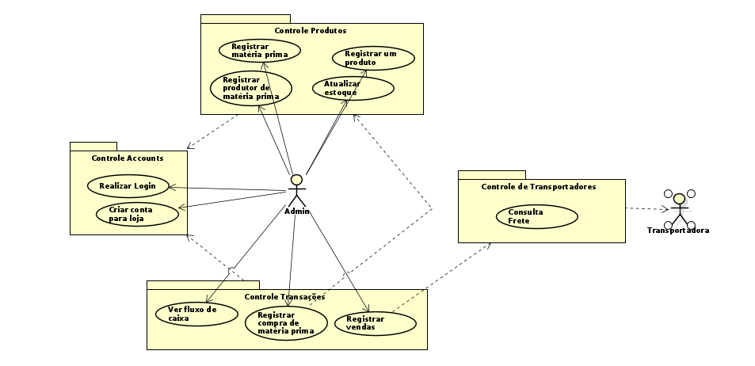

# Projeto com SOA

---

# Consertos RUP

---

1. Em Criar Conta, o usuário deve informar os campos ( nome, email, nome de loja e senha.) e não um objeto. O objeto deve ser criado pela tela e passado para o controlador. 

---

2. Em Efetuar Login, não há uma criação de usuário. A collection deve ter um método reflexivo (em vez de create, para procurar o usuário na collection

---

3. Em Criar Venda, em vez de TransactionCollection fazer todo o fluxo de controle, isso deveria ser feito pelo TransactionControl. Correio deve ser uma fronteira e deve incluir o ator Correio.  Promover Item para Transaction (em vez de ficar em Sale e Purchase).

---

# Especificação do Modelo de Negócio

---

## Modelo de Informações

---

## Modelo Navegacional

---

## Prototipo de Interface Gráfica

---

# Análise de Serviços

---

## Divisão em serviços

### Serviços stateful:
- Serviço de autenticação
- Serviço de transações
- Serviço de transporte/entrega
- Serviço de produtos
### Serviços stateless
- Serviço do webclient, com interfaces para gerenciamento de produtos e gerenciamento de transações

---

## Modelo de Interação dos Serviços

---

## Arquitetura de Serviços

---

## Modelo de Informações Refinado

---

## Diagrama de Componentes

---

